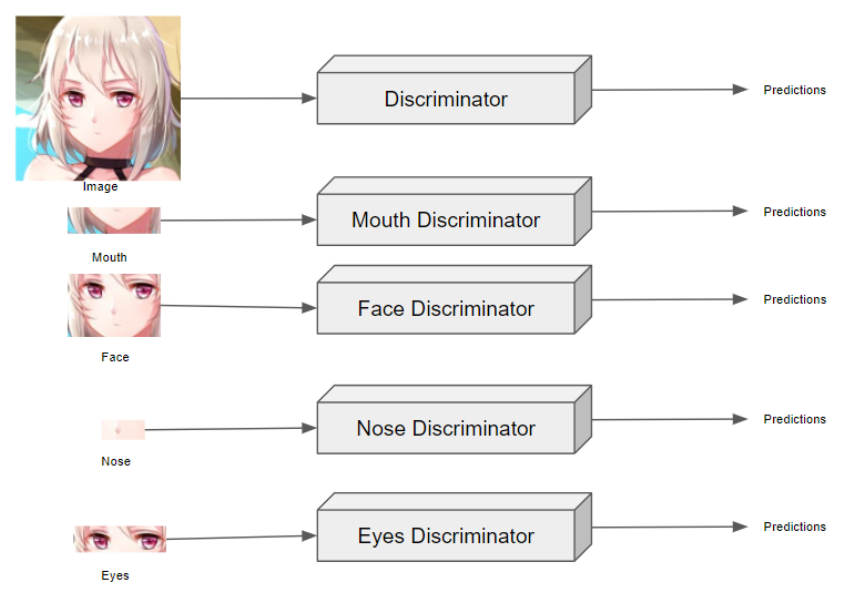
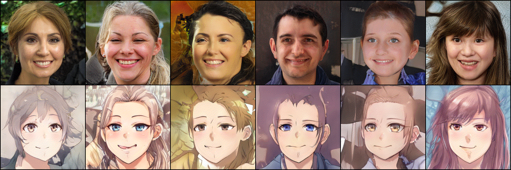
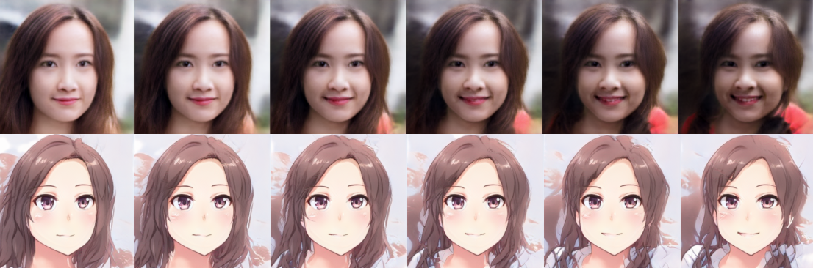

# Face Cartoonization and Editing using Generative Adversarial Network

The aim of this project is to translate a face from a real human face into a cartoon face. The translation is achieved through the use of multiple discriminators used to predict localised regions of the face to guide the generator to generate stylised faces with lesser artifacts and with better retention of original identity.

Project Report: https://hdl.handle.net/10356/156440


The codebase is based of the following repositories:
- [rosinality/stylegan2-pytorch](https://github.com/rosinality/stylegan2-pytorch)
- [happy-jihye/Cartoon-StyleGAN](https://github.com/happy-jihye/Cartoon-StyleGAN)


## Architecture



## Results

### Generation


### Simple translations


### Image Editing





## Pretrained models

| Model        | Description                                    | Link |
| ------------ |----------------------------------------------|----------------------------------------------|
| FFHQ 256x256 | Original model trained on 256x256 FFHQ images. | https://drive.google.com/file/d/12zPg8T24L0ocIe_2MwAVh673C-VAbW4_/view?usp=sharing |
| Anime model  | Model trained with proposed architecture.      | https://drive.google.com/file/d/12mL7N3_lIKwgp-_QqEs3DjPneNEhLG74/view?usp=sharing | 
| Factor file  | Factor file produced from closed-form factorisation | https://drive.google.com/file/d/12sJ17-7LEqZzkIQKHY34ax8qUPwPLCfZ/view?usp=sharing |

## Dataset

The anime images are downloaded from: https://www.kaggle.com/datasets/subinium/highresolution-anime-face-dataset-512x512

## Environment

Install dependencies from requirements.txt.

```bash
Run pip install -r requirements.txt
```

Alternatively, build docker image with Dockerfile provided.

## Image generation (example)

```bash
python generate_image.py \
--n_img NUMBER_OF_IMAGES_YOU_WANT \
--swap \
--swap_num 2 \
--source FFHQ_MODEL.pt \
--target TRAINED_MODEL.pt \
--outdir YOUR_OUTPUT_DIRECTORY \
--output_name NAME_OF_OUTPUT_IMAGE
```

### Image editing

1) Perform closed form factorisation on trained model

```bash
python closed_form_factorization.py \
--factor_name YOUR_FACTOR_NAME.pt \
--ckpt TRAINED_MODEL.pt
```

2) Run code

```bash
python edit_image.py \
--n_img 8 \
--swap \
--swap_num 2 \
--source FFHQ_MODEL.pt \
--target TRAINED_MODEL.pt \
--factor FACTOR.pt \
--outdir DIR \
--index INDEX,INDEX,... \
--degree DEGREE
```

List of index known to alter corresponding features:

| Index | Features |
|--------------|---|
| 0,7,16,18,20,23,24,31,34,35,36,37 | Hair and Face Colour |
| 1,11,12,28 | Hair Colour |
| 2,3,17,19 | Face |
| 4,6 | Directions (to right) |
| 5 | Directions (to left) |
| 9 | Directions (to top right), hair colour |
| 10,25,32,33 | Hair colour, facial expression |
| 13,14,15 | Hair colour, hair style |
| 21,22 | Hair thickness |
| 26,27,29,30,39,40,41,42,45,53 | Facial expression |

## Training

### StyleGAN2

python train.py --batch BATCH_SIZE LMDB_PATH

```babsh
 python train.py \
 --batch=8 \
 --ckpt=ffhq256.pt \
 --augment \
 --path=LMDB_PATH \
 --expr_dir=EXPERIMENT_DIRECTORY
 ```